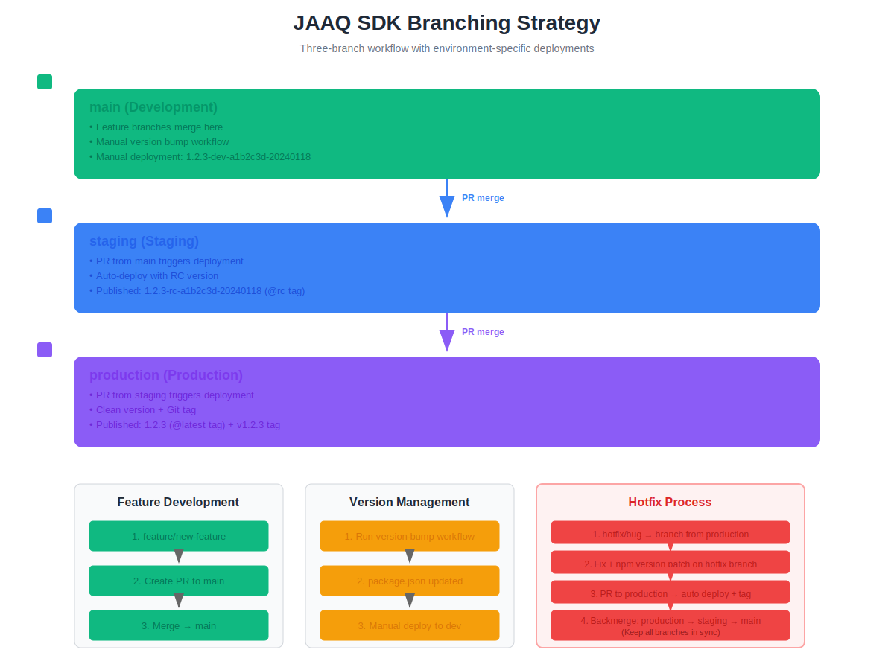

# Release Management Guide

This document describes the branching strategy, version management, and release process for the JAAQ SDK.

## Branching Strategy



We use a three-branch workflow with dedicated branches for each environment:

```
main (development environment)
  ↓
staging (staging environment)
  ↓
production (production environment)
```

### Branch Overview

- **main**: Development branch where features are merged. Deploys to development environment.
- **staging**: Release candidate branch. Deploys to staging environment for final testing.
- **production**: Production branch. Deploys to production environment with git tags.

### Visual Workflow

```
┌─────────────────────────────────────────────────────────────┐
│  Feature Development                                         │
│  feature/new-feature → PR → main                            │
└─────────────────────────────────────────────────────────────┘
                               ↓
┌─────────────────────────────────────────────────────────────┐
│  Development Deployment                                      │
│  Version Bump Workflow → Update package.json → main         │
│  Manual Deploy → 1.2.3-dev-a1b2c3d-20240118                │
└─────────────────────────────────────────────────────────────┘
                               ↓
┌─────────────────────────────────────────────────────────────┐
│  Staging Release                                             │
│  PR: main → staging                                          │
│  Auto Deploy → 1.2.3-rc-a1b2c3d-20240118                   │
└─────────────────────────────────────────────────────────────┘
                               ↓
┌─────────────────────────────────────────────────────────────┐
│  Production Release                                          │
│  PR: staging → production                                    │
│  Auto Deploy → 1.2.3 + Git Tag v1.2.3                      │
└─────────────────────────────────────────────────────────────┘
                               ↓
┌─────────────────────────────────────────────────────────────┐
│  Hotfix (if needed)                                          │
│  hotfix/critical-bug → PR → production                      │
│  Deploy + Tag → Backmerge to staging → Backmerge to main   │
└─────────────────────────────────────────────────────────────┘
```

## Version Format

The SDK uses semantic versioning with environment-specific suffixes:

| Environment | Format                        | Example                      | NPM Tag   |
| ----------- | ----------------------------- | ---------------------------- | --------- |
| Development | `{version}-dev-{hash}-{date}` | `1.2.3-dev-a1b2c3d-20240118` | `@dev`    |
| Staging     | `{version}-rc-{hash}-{date}`  | `1.2.3-rc-a1b2c3d-20240118`  | `@rc`     |
| Production  | `{version}`                   | `1.2.3`                      | `@latest` |

Where:

- `{version}`: Semantic version from package.json (e.g., 1.2.3)
- `{hash}`: Short git commit hash (7 characters)
- `{date}`: Date in YYYYMMDD format

All versions are published to the same package: `@jaaq/jaaq-sdk-js`

**Package Access:** Currently private (requires npm authentication and organization access). To make public later, update `publishConfig.access` in package.json to `"public"`.

**Prerequisites for Private Package:**

- Users must be added to the `@jaaq` npm organization
- Users must authenticate: `npm login`
- Requires npm Pro, Teams, or Enterprise plan for private scoped packages

## Release Process

### 1. Version Bump (Development)

Version changes are managed through a dedicated workflow that updates package.json.

**Steps:**

1. Go to Actions → Version Bump workflow
2. Click "Run workflow"
3. Select branch: `main`
4. Enter version bump type:
   - `major` - Breaking changes (1.0.0 → 2.0.0)
   - `minor` - New features (1.0.0 → 1.1.0)
   - `patch` - Bug fixes (1.0.0 → 1.0.1)
   - Or explicit version: `1.2.3`
5. Run workflow

The workflow will:

- Update package.json with the new version
- Commit the change to main
- Push to repository

**Example:**

```bash
Version bump type: minor
Current: 1.2.3 → New: 1.3.0
Commit: "chore: bump version to 1.3.0"
```

### 2. Development Deployment

After version bump, deploy to development environment for testing.

**Trigger:**

- Automatic: When PR is merged to main
- Manual: Actions → CI - Development → Run workflow

**Result:**

- Package published: `@jaaq/jaaq-sdk-js@1.3.0-dev-a1b2c3d-20240118`
- NPM tag: `@dev`
- S3 bucket: `jaaq-sdk-js/v1.3.0-dev-a1b2c3d-20240118/` and `jaaq-sdk-js/latest/`

**Installation:**

```bash
npm login
npm install @jaaq/jaaq-sdk-js@dev
```

**Note:** Every PR merge to main automatically triggers a development deployment.

### 3. Staging Release

When development testing is complete, promote to staging.

**Steps:**

1. Create PR from `main` to `staging`
2. Review and merge PR
3. Pipeline automatically deploys to staging

**Result:**

- Package published: `@jaaq/jaaq-sdk-js@1.3.0-rc-a1b2c3d-20240118`
- NPM tag: `@rc`
- S3 bucket: `jaaq-sdk-js/v1.3.0-rc-a1b2c3d-20240118/` and `jaaq-sdk-js/latest/`

**Installation:**

```bash
npm login
npm install @jaaq/jaaq-sdk-js@rc
```

### 4. Production Release

When staging testing is complete, promote to production.

**Steps:**

1. Create PR from `staging` to `production`
2. Review and merge PR
3. Pipeline automatically:
   - Deploys to production
   - Creates git tag `v1.3.0`
   - Pushes tag to repository

**Result:**

- Package published: `@jaaq/jaaq-sdk-js@1.3.0`
- NPM tag: `@latest`
- Git tag: `v1.3.0`
- S3 bucket: `jaaq-sdk-js/v1.3.0/` and `jaaq-sdk-js/latest/`

**Installation:**

```bash
npm login
npm install @jaaq/jaaq-sdk-js
npm install @jaaq/jaaq-sdk-js@latest
```

## Hotfix Process

Critical bugs in production require immediate fixes through hotfix branches.

### Creating a Hotfix

**Steps:**

1. Create hotfix branch from `production`:

   ```bash
   git checkout production
   git pull origin production
   git checkout -b hotfix/critical-bug-description
   ```

2. Make necessary fixes and commit:

   ```bash
   git add .
   git commit -m "fix: critical bug description"
   ```

3. **Bump version as patch** on the hotfix branch:

   ```bash
   npm version patch --no-git-tag-version
   git add package.json
   git commit -m "chore: bump version to $(node -p "require('./package.json').version")"
   ```

4. Push hotfix branch:

   ```bash
   git push origin hotfix/critical-bug-description
   ```

5. Create PR from `hotfix/critical-bug-description` to `production`

6. Review and merge PR
   - Pipeline automatically deploys hotfix to production
   - Creates git tag (e.g., `v1.3.1`)

7. **Backmerge to staging**:

   ```bash
   git checkout staging
   git pull origin staging
   git merge production
   git push origin staging
   ```

8. **Backmerge to main**:
   ```bash
   git checkout main
   git pull origin main
   git merge staging
   git push origin main
   ```

### Hotfix Example Timeline

```
Day 1 10:00 - Critical bug discovered in production (v1.3.0)
Day 1 10:15 - Create hotfix/fix-auth-leak from production
Day 1 10:30 - Fix implemented and tested locally
Day 1 10:45 - Bump version patch on hotfix branch (1.3.0 → 1.3.1)
Day 1 10:50 - Push hotfix branch
Day 1 11:00 - Create PR: hotfix/fix-auth-leak → production
Day 1 11:15 - PR reviewed and merged
Day 1 11:20 - Production auto-deployed with v1.3.1 + git tag created
Day 1 11:25 - Backmerge to staging and main
```

## Git Tags

Git tags are automatically created for production releases.

**Format:** `v{version}`

**Examples:**

- `v1.0.0`
- `v1.2.3`
- `v2.0.0`

**Viewing tags:**

```bash
git tag -l
git show v1.3.0
```

**Checking out a specific version:**

```bash
git checkout tags/v1.3.0
```

## NPM Distribution Tags

The package uses npm distribution tags to manage different versions:

| Tag      | Purpose                      | Command                             |
| -------- | ---------------------------- | ----------------------------------- |
| `latest` | Production releases          | `npm install @jaaq/jaaq-sdk-js`     |
| `rc`     | Release candidates (staging) | `npm install @jaaq/jaaq-sdk-js@rc`  |
| `dev`    | Development builds           | `npm install @jaaq/jaaq-sdk-js@dev` |

**Viewing all versions:**

```bash
npm view @jaaq/jaaq-sdk-js versions
npm view @jaaq/jaaq-sdk-js dist-tags
```

## S3 Asset Distribution

UMD bundles are uploaded to S3 for CDN distribution. Each environment has its own S3 bucket.

**Structure per environment bucket:**

```
s3://dev-bucket/jaaq-sdk-js/
  ├── v1.2.3-dev-a1b2c3d-20240118/
  │   └── index.min.js
  └── latest/
      └── index.min.js (latest dev)

s3://staging-bucket/jaaq-sdk-js/
  ├── v1.2.3-rc-a1b2c3d-20240118/
  │   └── index.min.js
  └── latest/
      └── index.min.js (latest rc)

s3://prod-bucket/jaaq-sdk-js/
  ├── v1.2.3/
  │   └── index.min.js
  └── latest/
      └── index.min.js (latest production)
```

**Usage in HTML:**

```html
<script src="https://dev-cdn.example.com/jaaq-sdk-js/latest/index.min.js"></script>
<script src="https://staging-cdn.example.com/jaaq-sdk-js/latest/index.min.js"></script>
<script src="https://cdn.example.com/jaaq-sdk-js/latest/index.min.js"></script>
<script src="https://cdn.example.com/jaaq-sdk-js/v1.2.3/index.min.js"></script>
```

## Switching from Private to Public Package

Currently, the package is private and requires authentication to install. To make it public:

1. Update `package.json`:

   ```json
   "publishConfig": {
     "access": "public"
   }
   ```

2. Commit and push the change to main

3. All future releases will be publicly accessible without authentication

4. Previous private versions remain private (cannot change retroactively)

**Note:** Once any version is published as public, the entire package becomes public. You cannot mix private and public versions.

## Best Practices

### Version Management

1. **Always bump version before deployment** - Run Version Bump workflow first
2. **Use semantic versioning** - Follow major.minor.patch conventions
3. **One version across environments** - Same base version flows through dev → staging → production
4. **Document breaking changes** - Update CHANGELOG.md for major versions

### Branch Management

1. **Keep branches in sync** - Regularly merge down (production → staging → main) for hotfixes
2. **Never skip environments** - Always go dev → staging → production
3. **Delete feature branches** - After merge to main
4. **Protect branches** - Enable branch protection for main, staging, production

### Testing Requirements

1. **Development** - Unit tests, integration tests must pass
2. **Staging** - Full regression testing, UAT
3. **Production** - Smoke tests only (already tested in staging)

### Hotfix Guidelines

1. **Only for critical issues** - Security, data loss, service down
2. **Minimal changes** - Fix the immediate issue only
3. **Always backmerge** - Ensure all branches receive the fix
4. **Test in production immediately** - Verify fix works

## Troubleshooting

### Version mismatch

If versions get out of sync between branches:

```bash
git checkout main
git log --oneline -10
git checkout staging
git merge main
git push origin staging
```

### Failed deployment

1. Check GitHub Actions logs for specific error
2. Verify environment variables in GitHub Settings → Secrets
3. Ensure AWS credentials are valid
4. Check NPM token hasn't expired

### Tag conflicts

If git tag already exists:

```bash
git tag -d v1.2.3
git push origin :refs/tags/v1.2.3
```

Then re-run the production deployment.

## Workflows Reference

### version-bump.yml

**Trigger:** Manual workflow_dispatch  
**Branch:** main only  
**Purpose:** Update package.json version  
**Usage:** Run before deploying new features to dev

### ci-development.yml

**Trigger:** Automatic on PR merge to main, or manual workflow_dispatch  
**Purpose:** Deploy to development environment  
**Version format:** `{version}-dev-{hash}-{date}`

### ci-staging.yml

**Trigger:** Automatic on PR merge to staging  
**Purpose:** Deploy to staging environment  
**Version format:** `{version}-rc-{hash}-{date}`

### ci-production.yml

**Trigger:** Automatic on PR merge to production  
**Purpose:** Deploy to production environment and create git tag  
**Version format:** `{version}` (clean) + git tag `v{version}`

### base.yml

**Trigger:** Called by other workflows  
**Purpose:** Reusable CI/CD logic for all environments  
**Features:** Build, test, version computation, npm publish, S3 upload, git tagging
